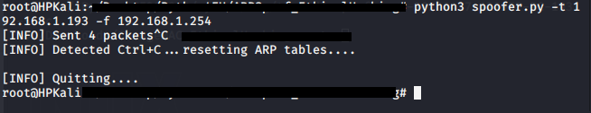

# ARP Spoofing in Linux
Using scapy to make ARP packets for Man-in-the-Middle attacks
## Getting Started
Download the repository and run the program using:
> Python == 3.7
>
> Scapy == 2.4.3
>
## Details
| File | Information |
|-------|------------|
| getMAC.py  | Get MAC Address | 
| output.png  | Output of the program | 
| spoofer.py  | Main program | 
| venv  | virtual python environment | 
## Output
